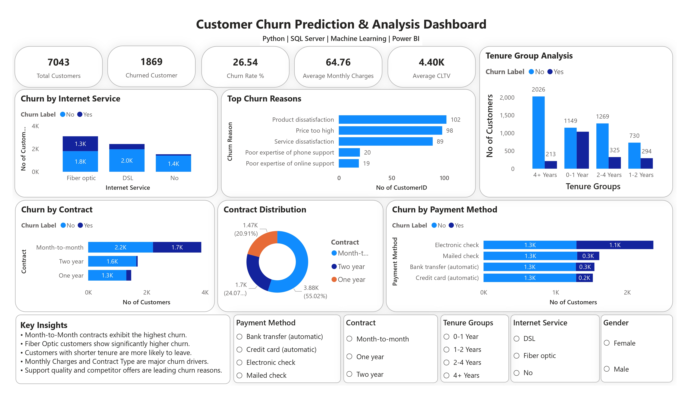

# 📊 Customer Churn Prediction & Analysis

## Business Problem

Customer churn directly impacts revenue and growth in the telecom industry. The objective of this project is to identify customers at risk of leaving, understand the factors driving churn, and provide actionable recommendations to improve retention.

---

## Project Objectives

* Analyze customer behavior and churn patterns.
* Identify key factors influencing customer attrition.
* Build machine learning models to predict churn.
* Develop an interactive Power BI dashboard for business stakeholders.

---

## Dataset

* 7,043 telecom customer records
* 33 customer-related features
* Target Variable: Churn (Yes/No)

---

## Tools & Technologies

**Programming & Analysis**

* Python
* SQL Server

**Libraries**

* Pandas
* NumPy
* Matplotlib
* Seaborn
* Scikit-learn

**Visualization**

* Power BI

---

## Project Workflow

1. Data Cleaning & Preprocessing
2. Exploratory Data Analysis (EDA)
3. Feature Engineering
4. Logistic Regression Model
5. Random Forest Model
6. Model Evaluation
7. Feature Importance Analysis
8. Dashboard Development

---

## Key Insights

* Customers with shorter tenure are more likely to churn.
* Month-to-month contracts have the highest churn rates.
* Higher monthly charges are associated with increased churn.
* Customers without Tech Support and Online Security services show significantly higher churn risk.

---

## Business Recommendations

* Promote long-term contract plans.
* Improve onboarding for new customers.
* Offer bundled support and security packages.
* Launch targeted retention campaigns for high-risk customers.

---

## Dashboard Preview

---

## Dashboard Features

* Churn Rate KPI
* Customer Segmentation
* Contract Analysis
* Internet Service Analysis
* Revenue Impact Analysis
* Churn Driver Identification

---

## Machine Learning Models

### Logistic Regression

* Built baseline churn prediction model.

### Random Forest

* Improved prediction performance and feature importance analysis.

---

## Project Outcome

This project demonstrates how data analytics, machine learning, and business intelligence can be combined to identify churn drivers, predict customer behavior, and support data-driven decision-making.

---

⭐ If you found this project useful, feel free to star the repository.
